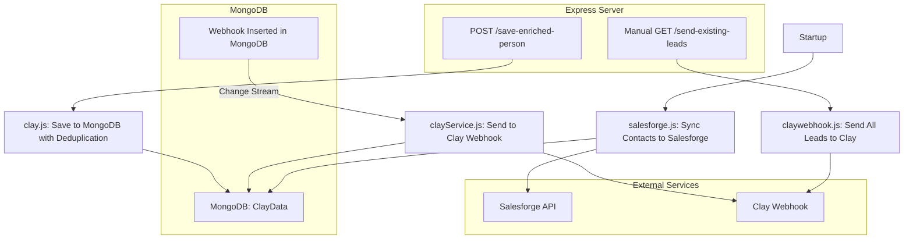

# Webhook Receiver

A Node.js/Express application for receiving, deduplicating, and forwarding webhook data between MongoDB, Clay, and Salesforge. It provides endpoints for saving enriched person data, sending leads to Clay, and syncing contacts to Salesforge. The app uses environment variables for configuration and is structured for clarity and extensibility.

---

## Table of Contents
- [Features](#features)
- [Architecture](#architecture)
- [Setup](#setup)
- [Environment Variables](#environment-variables)
- [Endpoints](#endpoints)
- [Service Logic](#service-logic)
- [File Structure](#file-structure)
- [License](#license)

---

## Features
- **Webhook Listener:** Watches MongoDB for new webhook inserts and sends them to Clay in real-time.
- **Deduplication:** Prevents duplicate person records in MongoDB.
- **Manual Lead Push:** Allows manual sending of all unsent leads to Clay.
- **Salesforge Sync:** Syncs all contacts from MongoDB to Salesforge on startup.

---

## Architecture



---

## Setup

1. **Clone the repository:**
   ```bash
   git clone <repo-url>
   cd webhook-receiver
   ```
2. **Install dependencies:**
   ```bash
   npm install
   ```
3. **Configure environment variables:**
   Create a `.env` file in the root directory with the following variables:
   ```env
   MONGO_URI=your_mongodb_connection_string
   CLAY_WEBHOOK_URL=your_clay_webhook_url
   DB_NAME=forceequals
   COLLECTION_NAME=ClayData
   SALESFORGE_API_KEY=your_salesforge_api_key
   WORKSPACE_ID=your_salesforge_workspace_id
   PORT=3000 # optional, defaults to 3000
   ```
4. **Start the server:**
   ```bash
   node index.js
   ```

---

## Environment Variables
| Variable              | Description                                 |
|-----------------------|---------------------------------------------|
| `MONGO_URI`           | MongoDB connection string                   |
| `CLAY_WEBHOOK_URL`    | Clay webhook endpoint URL                   |
| `DB_NAME`             | MongoDB database name for contacts          |
| `COLLECTION_NAME`     | MongoDB collection name for contacts        |
| `SALESFORGE_API_KEY`  | API key for Salesforge                      |
| `WORKSPACE_ID`        | Salesforge workspace ID                     |
| `PORT`                | Port for Express server (default: 3000)     |

---

## Endpoints

### 1. `POST /save-enriched-person`
- **Description:** Saves an enriched person to MongoDB if not already present (deduplication by name, company, job title).
- **Request Body:**
  ```json
  {
    "name": "John Doe",
    "company": "Acme Corp",
    "jobtitle": "Engineer",
    "email": "john@acme.com",      // optional
    "linkedin": "linkedin-url"     // optional
  }
  ```
- **Responses:**
  - `200 OK` `{ success: true, id: <insertedId> }` if inserted
  - `200 OK` `{ success: false, message: 'Already exists' }` if duplicate
  - `400 Bad Request` if required fields are missing
  - `500 Internal Server Error` on DB error

### 2. `GET /send-existing-leads`
- **Description:** Sends all unsent leads from the `webhooks` collection to Clay. Marks sent leads in `sentLeads`.
- **Responses:**
  - `200 OK` `{ success: true, message: 'Leads sent to Clay' }`
  - `500 Internal Server Error` on error

---

## Service Logic

### Real-Time Webhook to Clay (`services/clayService.js`)
- Watches the `webhooks` collection for new inserts using MongoDB change streams.
- Sends each new document to the Clay webhook endpoint.
- Logs errors and successful sends.

### Salesforge Sync (`services/salesforge.js`)
- On startup, fetches all contacts from the specified MongoDB collection.
- Formats and sends each contact to Salesforge's API.
- Handles duplicate contacts and logs results.

### Database Connection (`db/mongodb.js`)
- Exports a MongoDB client instance using the URI from environment variables.

---

## File Structure
```
webhook-receiver/
  db/
    mongodb.js           # MongoDB client setup
  index.js               # Main entry point
  package.json           # Project metadata and dependencies
  routes/
    clay.js              # /save-enriched-person endpoint
    claywebhook.js       # /send-existing-leads endpoint
  services/
    clayService.js       # Real-time webhook to Clay
    salesforge.js        # Salesforge sync logic
```

---

## License

This project is licensed under the ISC License. 